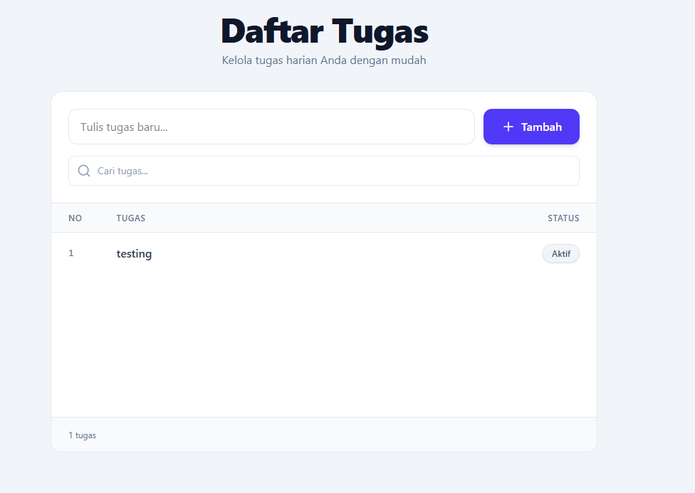

# GoodEva - Aplikasi Todo List



## Cara Jalanin

### Pake Docker

```bash
docker compose up
docker compose down
```

Buka browser:
- Frontend: http://localhost:5173
- API: http://localhost:3000/api

### Tanpa Docker

**Backend:**
```bash
cd project
npm install
npm run start:dev
```

**Frontend:**
```bash
cd goodeva-frontend
npm install
npm run dev
```

## Versi Node

- **Node.js:** >= 20.0.0 (saya pakai v22.18.0)
- **npm:** >= 10.0.0 (saya pakai 10.9.3)

## Keputusan Teknis

1. **React Query untuk State Management** - Karena menyediakan caching otomatis, loading/error states, dan refetch yang lebih mudah dari redux.

2. **In-Memory Storage di Backend** - Sesuai requirement, data disimpan di array sementara. Mudah diganti ke database sql/nosql.

3. **Global AuthGuard dengan x-user-id** - Implementasi auth ringan menggunakan NestJS Guard yang mengecek header `x-user-id` di setiap request. Frontend mengirimkan ID unik yang di-generate sekali dan disimpan di localStorage.

## Tech Stack

**Backend:** NestJS, TypeScript, class-validator

**Frontend:** React 19, Vite, TailwindCSS 4, React Query, Axios

**Deployment:** Docker, Docker Compose, Nginx
